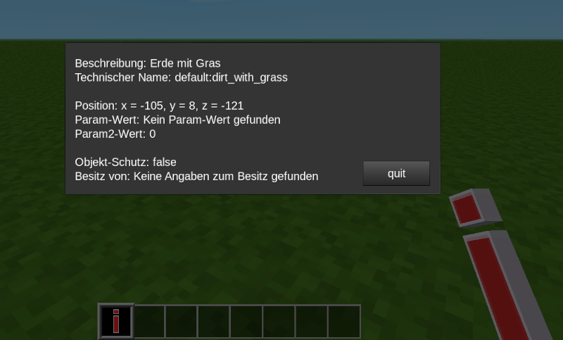

# Alan

Das Werkzeug »Alan« hilft, Informationen über den Block zu erhalten, den man gerade mit dem Werkzeug angeklickt hat. Die Informationen werden in einem Formspec angezeigt und können von dort kopiert werden. Nützlich zum Beispiel für WorldEdit, wenn man den technischen Namen eines Blockes benötigt. Oder, um bei einem als »unknown object« angezeigtem Block herauszufinden, welcher Mod ihn produziert.

The tool »Alan« helps to get information about the item you just punched with the tool. The information would be shown in a formspec and can be copied from there. Useful, if you for example need the technical name of an item for WorldEdit. Or which mod produces an »unknown object«.

Verwendung:
Man schlägt mit dem Werkzeug auf den Block, über den man gerne weiterführende Informationen hätte. Es öffnet sich ein Formspec, der die Informationen anzeigt.

Hinweise:
Funktioniert nicht bei allen Blöcken (zum Beispiel mit Q abgeworfenen Objekten). In Version 5.4 ist es nicht möglich, aus einem formspecs Zeichenketten zu kopieren ...

Lizenz:
Copyright (C) 2022 Norbert Thien, multimediamobil - Region Süd, Lizenz: Creative Commons BY-SA 4.0
